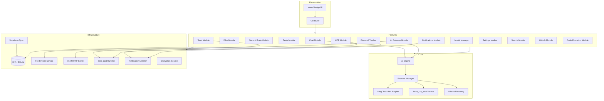
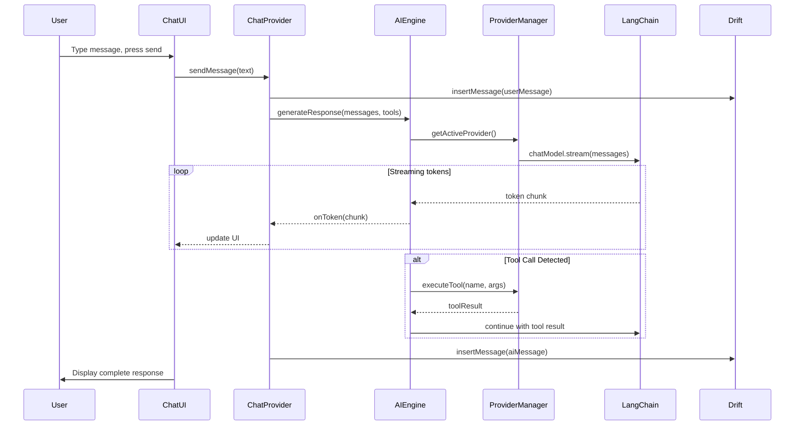
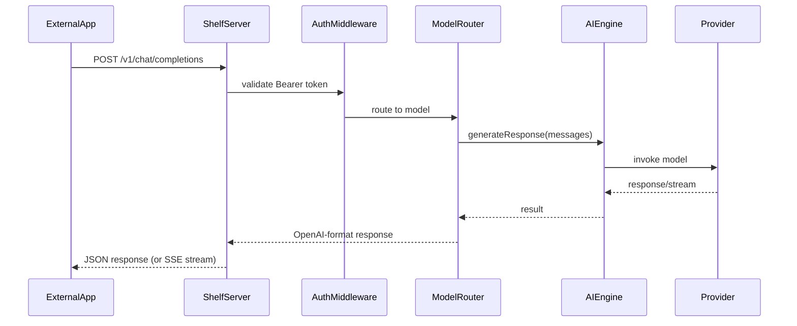
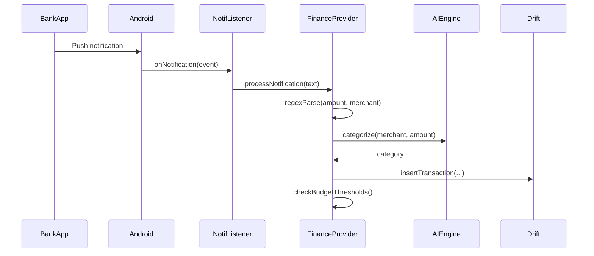

# Prism — Architecture

## 1 Architecture Overview

Prism follows a **feature-first modular architecture** with Riverpod as the dependency injection and state management layer. Each feature is a self-contained module with its own providers, repositories, models, and UI. Cross-cutting concerns live in `core/` and `shared/`.

```
┌─────────────────────────────────────────────────────────┐
│                    Presentation Layer                     │
│  Moon Design UI     │  GoRouter  │  Riverpod Consumers  │
├─────────────────────────────────────────────────────────┤
│                    Application Layer                     │
│  Use Cases  │  Riverpod Providers  │  State Notifiers    │
├─────────────────────────────────────────────────────────┤
│                      Domain Layer                        │
│  Entities  │  Repository Interfaces  │  Value Objects     │
├─────────────────────────────────────────────────────────┤
│                   Infrastructure Layer                   │
│  Drift DAOs  │  API Clients  │  Platform Services        │
├─────────────────────────────────────────────────────────┤
│                    External Services                     │
│ llama_cpp  │ LangChain  │ Supabase │ shelf │ mcp_dart   │
└─────────────────────────────────────────────────────────┘
```

## 2 Module Diagram



## 3 Directory Structure

```
lib/
├── main.dart                       # App entry point, Riverpod ProviderScope
├── app.dart                        # MaterialApp configuration, MoonTheme, routing
├── core/
│   ├── ai/
│   │   ├── ai_engine.dart          # Unified AI interface
│   │   ├── provider_manager.dart   # Provider registry and switching
│   │   ├── langchain_adapter.dart  # LangChain.dart wrapper
│   │   ├── local_inference.dart    # llama_cpp_dart service
│   │   ├── ollama_discovery.dart   # mDNS/DNS-SD Ollama scanner
│   │   └── model_config.dart       # Model configuration value objects
│   ├── database/
│   │   ├── database.dart           # Drift database definition
│   │   ├── database.g.dart         # Generated code
│   │   ├── tables/                 # Table definitions
│   │   │   ├── conversations.dart
│   │   │   ├── messages.dart
│   │   │   ├── files.dart
│   │   │   ├── tasks.dart
│   │   │   ├── para_items.dart
│   │   │   ├── transactions.dart
│   │   │   ├── providers_table.dart
│   │   │   ├── personas.dart
│   │   │   ├── tool_definitions.dart
│   │   │   ├── mcp_servers.dart
│   │   │   ├── skillsets.dart
│   │   │   ├── gateway_tokens.dart
│   │   │   └── settings.dart
│   │   └── daos/                   # Data access objects
│   │       ├── conversation_dao.dart
│   │       ├── message_dao.dart
│   │       ├── file_dao.dart
│   │       ├── task_dao.dart
│   │       ├── para_dao.dart
│   │       ├── transaction_dao.dart
│   │       └── settings_dao.dart
│   ├── services/
│   │   ├── file_system_service.dart
│   │   ├── encryption_service.dart
│   │   ├── notification_service.dart
│   │   ├── sync_service.dart
│   │   └── platform_service.dart
│   ├── router/
│   │   ├── app_router.dart         # GoRouter configuration
│   │   └── routes.dart             # Route constants
│   └── theme/
│       ├── prism_theme.dart        # Moon Design theme config
│       └── color_schemes.dart      # Light/dark color schemes
├── features/
│   ├── chat/
│   │   ├── providers/              # Riverpod providers
│   │   │   ├── chat_provider.dart
│   │   │   ├── conversation_list_provider.dart
│   │   │   └── streaming_provider.dart
│   │   ├── repositories/
│   │   │   └── chat_repository.dart
│   │   ├── models/                 # Feature-specific models
│   │   │   └── chat_message.dart
│   │   └── ui/
│   │       ├── chat_screen.dart
│   │       ├── conversation_list.dart
│   │       ├── message_bubble.dart
│   │       └── chat_input.dart
│   ├── files/
│   │   ├── providers/
│   │   ├── repositories/
│   │   └── ui/
│   │       ├── file_explorer_screen.dart
│   │       ├── file_tree.dart
│   │       ├── rich_editor_screen.dart
│   │       └── code_editor_screen.dart
│   ├── second_brain/
│   │   ├── providers/
│   │   ├── repositories/
│   │   └── ui/
│   │       ├── para_dashboard.dart
│   │       ├── projects_view.dart
│   │       ├── areas_view.dart
│   │       ├── resources_view.dart
│   │       ├── archives_view.dart
│   │       └── note_editor.dart
│   ├── tasks/
│   │   ├── providers/
│   │   ├── repositories/
│   │   └── ui/
│   │       ├── task_list_screen.dart
│   │       ├── kanban_board.dart
│   │       ├── task_calendar.dart
│   │       └── task_detail.dart
│   ├── finance/
│   │   ├── providers/
│   │   ├── repositories/
│   │   └── ui/
│   │       ├── finance_dashboard.dart
│   │       ├── transaction_list.dart
│   │       ├── budget_view.dart
│   │       └── spending_chart.dart
│   ├── tools/
│   │   ├── providers/
│   │   ├── built_in/               # Built-in tool implementations
│   │   │   ├── web_search_tool.dart
│   │   │   ├── calculator_tool.dart
│   │   │   ├── file_tool.dart
│   │   │   └── url_fetcher_tool.dart
│   │   └── ui/
│   │       ├── tools_grid_screen.dart
│   │       └── tool_config_sheet.dart
│   ├── mcp/
│   │   ├── providers/
│   │   ├── services/
│   │   │   ├── mcp_host_service.dart
│   │   │   └── mcp_client_service.dart
│   │   └── ui/
│   │       ├── mcp_servers_screen.dart
│   │       └── mcp_tool_browser.dart
│   ├── gateway/
│   │   ├── providers/
│   │   ├── services/
│   │   │   ├── gateway_server.dart      # shelf HTTP server
│   │   │   ├── openai_compat_handler.dart
│   │   │   └── auth_middleware.dart
│   │   └── ui/
│   │       ├── gateway_settings.dart
│   │       └── gateway_logs.dart
│   ├── notifications/
│   │   ├── providers/
│   │   ├── services/
│   │   │   ├── smart_notification_service.dart
│   │   │   ├── procrastination_detector.dart
│   │   │   └── notification_listener_bridge.dart
│   │   └── ui/
│   │       └── notification_settings.dart
│   ├── models/                      # Model management feature
│   │   ├── providers/
│   │   ├── repositories/
│   │   └── ui/
│   │       ├── model_manager_screen.dart
│   │       ├── model_download.dart
│   │       └── ollama_browser.dart
│   ├── search/
│   │   ├── providers/
│   │   └── ui/
│   │       └── search_screen.dart
│   ├── github_integration/
│   │   ├── providers/
│   │   ├── services/
│   │   │   └── github_service.dart
│   │   └── ui/
│   │       ├── repo_browser.dart
│   │       └── issue_view.dart
│   ├── code_execution/
│   │   ├── providers/
│   │   ├── services/
│   │   │   ├── remote_executor.dart
│   │   │   ├── quickjs_executor.dart
│   │   │   └── docker_executor.dart
│   │   └── ui/
│   │       └── code_runner_sheet.dart
│   └── settings/
│       ├── providers/
│       └── ui/
│           ├── settings_screen.dart
│           ├── provider_config.dart
│           ├── appearance_settings.dart
│           ├── privacy_settings.dart
│           └── sync_settings.dart
├── shared/
│   ├── widgets/                     # Shared UI components
│   │   ├── app_scaffold.dart        # App shell with sidebar
│   │   ├── command_palette.dart     # Global command palette
│   │   ├── loading_indicator.dart
│   │   └── error_view.dart
│   ├── extensions/
│   │   └── context_extensions.dart
│   └── utils/
│       ├── markdown_utils.dart
│       └── date_utils.dart
└── generated/                       # Drift, Riverpod code generation output
```

## 4 Key Architectural Decisions

### 4.1 State Management — Riverpod 2.x

- **Why Riverpod over BLoC**: Less boilerplate, better testability, compile-time safety, tree-shaking support.
- Code generation via `riverpod_generator` for `@riverpod` annotations.
- `AsyncNotifierProvider` for async state with loading/error handling.
- `StreamProvider` for reactive Drift database watches.
- `Provider` for dependency injection of services.

### 4.2 Database — Drift (SQLite)

- **Why Drift over Isar**: Isar is discontinued. Drift is Flutter Favorite, actively maintained, supports reactive queries, full web support (sql.js), and type-safe schema.
- WAL mode for concurrent reads/writes.
- FTS5 virtual tables for full-text search.
- Schema versioning with migration system.
- Compiled SQL queries for performance.

### 4.3 UI — moon_design

- **Why moon_design**: Moon Design System with 30+ themed widgets, squircle borders, token-based theming via ThemeExtension, works alongside MaterialApp.
- New York theme as default.
- Built-in dark mode support.
- Components: `NavigationSidebar`, `Card`, `Button` variants, `Command` (palette), `TreeView`, `Table`, `Accordion`, `Tabs`, `ChatBubble`, `ChatGroup`, etc.

### 4.4 AI Engine — LangChain.dart Adapter

- All AI interactions go through `AiEngine` → `ProviderManager` → LangChain `BaseChatModel`.
- Provider-specific adapters handle serialization differences.
- Tool calling normalized to LangChain's function-calling interface.
- Streaming via `BaseChatModel.stream()`.

### 4.5 Local Inference — llama_cpp_dart

- **Why llama_cpp_dart over llama_sdk**: llama_sdk is vendored in Maid and not published. llama_cpp_dart is on pub.dev, actively maintained, uses FFI.
- Model loading with mmap for memory efficiency.
- GPU layer offloading configuration.
- Inference in isolate to prevent UI jank.

### 4.6 AI Gateway — shelf

- **Why shelf**: Official Dart team package, lightweight, composable middleware, production-tested.
- Runs as in-process HTTP server (no separate process).
- OpenAI-compatible API surface for maximum client compatibility.
- Middleware chain: auth → rate limiting → logging → routing → model execution.

### 4.7 MCP — mcp_dart

- Host mode: connect to external MCP tool servers.
- Client mode: expose Prism's tools to other MCP hosts.
- Transport: stdio for local servers, SSE for remote.
- Tool schemas auto-generated from tool definitions.

## 5 Data Flow Diagrams

### 5.1 Chat Message Flow



### 5.2 AI Gateway Request Flow



### 5.3 Financial Transaction Capture Flow



## 6 Cross-Cutting Concerns

### 6.1 Error Handling

- Global error boundary in Riverpod (`ProviderObserver`).
- Per-feature error states in `AsyncValue`.
- Network errors → retry with exponential backoff.
- Inference errors → graceful message ("Model encountered an error").
- File system errors → user notification with recovery options.

### 6.2 Logging

- Structured logging via `dart:developer`.
- Log levels: debug, info, warning, error.
- AI Gateway request/response logging.
- MCP tool invocation logging.

### 6.3 Dependency Injection

- All dependencies provided via Riverpod.
- No service locators or singletons.
- Tests override providers for mocking.

### 6.4 Platform Abstraction

- `PlatformService` abstracts platform-specific APIs.
- Conditional imports for web vs. native.
- Feature flags for platform-unavailable features (e.g., notification listener on web).

## 7 Technology Integration Map

| Technology | Module | Purpose |
|---|---|---|
| llama_cpp_dart | core/ai | Local GGUF model inference |
| langchain_dart | core/ai | Provider abstraction |
| dart_openai | core/ai | OpenAI-compatible API client |
| Drift | core/database | Persistent storage, reactive queries |
| moon_design | all UI | Component library |
| GoRouter | core/router | Declarative navigation |
| Riverpod | all | State management, DI |
| shelf + shelf_router | features/gateway | AI Gateway HTTP server |
| mcp_dart | features/mcp | MCP host/client |
| re_editor | features/files | Code editing |
| appflowy_editor | features/files, second_brain | Rich text editing |
| github | features/github_integration | GitHub API |
| notification_listener_service | features/notifications, finance | Android notification access |
| google_mlkit_genai_summarization | features/chat | On-device summarization |
| puppeteer | features/tools | Desktop browser automation |
| flutter_secure_storage | core/services | Secure credential storage |
| supabase_flutter | core/services | Cloud sync |
| flutter_js | features/code_execution | QuickJS local execution |
