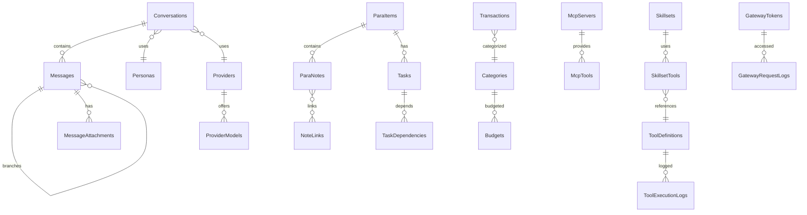

# Prism — Data Models (Drift Schemas)

> All schemas use **Drift 2.x** with SQLite. Tables are defined as Dart classes extending `Table`. Generated code provides type-safe companions, DAOs, and reactive `Stream` queries.

## 1 Database Definition

```dart
@DriftDatabase(
  tables: [
    Conversations, Messages, MessageAttachments,
    Providers, ProviderModels,
    Personas,
    PrismFiles, PrismFolders, FileLocks,
    ParaItems, ParaNotes, NoteLinks,
    Tasks, TaskDependencies,
    Transactions, Categories, Budgets,
    ToolDefinitions, ToolExecutionLogs,
    McpServers, McpTools,
    Skillsets, SkillsetTools,
    GatewayTokens, GatewayRequestLogs,
    NotificationRules,
    AppSettings,
  ],
  daos: [
    ConversationDao, MessageDao,
    ProviderDao, PersonaDao,
    FileDao, ParaDao, TaskDao,
    TransactionDao, ToolDao, McpDao,
    SkillsetDao, GatewayDao, SettingsDao,
  ],
)
class PrismDatabase extends _$PrismDatabase {
  PrismDatabase(QueryExecutor executor) : super(executor);

  @override
  int get schemaVersion => 1;

  @override
  MigrationStrategy get migration => MigrationStrategy(
    onCreate: (m) => m.createAll(),
    onUpgrade: stepByStep(/* version migrations */),
  );
}
```

---

## 2 Conversations & Messages

### 2.1 Conversations

```dart
class Conversations extends Table {
  IntColumn get id => integer().autoIncrement()();
  TextColumn get title => text().withLength(min: 1, max: 500)();
  TextColumn get summary => text().nullable()();
  IntColumn get personaId => integer().nullable().references(Personas, #id)();
  IntColumn get providerId => integer().nullable().references(Providers, #id)();
  TextColumn get modelId => text().nullable()();
  BoolColumn get isPinned => boolean().withDefault(const Constant(false))();
  BoolColumn get isArchived => boolean().withDefault(const Constant(false))();
  DateTimeColumn get createdAt => dateTime().withDefault(currentDateAndTime)();
  DateTimeColumn get updatedAt => dateTime().withDefault(currentDateAndTime)();
  TextColumn get syncId => text().nullable()();  // Supabase sync ID
}
```

### 2.2 Messages

```dart
class Messages extends Table {
  IntColumn get id => integer().autoIncrement()();
  IntColumn get conversationId => integer().references(Conversations, #id,
      onDelete: KeyAction.cascade)();
  IntColumn get parentMessageId => integer().nullable()
      .references(Messages, #id)();  // Branching support
  TextColumn get role => text()();  // 'user' | 'assistant' | 'system' | 'tool'
  TextColumn get content => text()();
  TextColumn get toolCalls => text().nullable()();  // JSON array of tool calls
  TextColumn get toolCallId => text().nullable()();  // For tool response messages
  IntColumn get promptTokens => integer().withDefault(const Constant(0))();
  IntColumn get completionTokens => integer().withDefault(const Constant(0))();
  RealColumn get costEstimate => real().nullable()();
  TextColumn get modelId => text().nullable()();
  IntColumn get providerId => integer().nullable()();
  BoolColumn get isError => boolean().withDefault(const Constant(false))();
  DateTimeColumn get createdAt => dateTime().withDefault(currentDateAndTime)();
  IntColumn get branchIndex => integer().withDefault(const Constant(0))();
  TextColumn get syncId => text().nullable()();
}
```

### 2.3 Message Attachments

```dart
class MessageAttachments extends Table {
  IntColumn get id => integer().autoIncrement()();
  IntColumn get messageId => integer().references(Messages, #id,
      onDelete: KeyAction.cascade)();
  TextColumn get type => text()();  // 'image' | 'file' | 'code' | 'audio'
  TextColumn get fileName => text()();
  TextColumn get filePath => text()();
  TextColumn get mimeType => text().nullable()();
  IntColumn get sizeBytes => integer().nullable()();
}
```

---

## 3 Providers & Models

### 3.1 Providers

```dart
class Providers extends Table {
  IntColumn get id => integer().autoIncrement()();
  TextColumn get name => text()();  // Display name
  TextColumn get type => text()();
  // 'openai' | 'gemini' | 'anthropic' | 'ollama' | 'mistral'
  // | 'local_llama' | 'custom_openai'
  TextColumn get baseUrl => text().nullable()();
  TextColumn get apiKeyRef => text().nullable()();  // Reference to secure storage key
  BoolColumn get isEnabled => boolean().withDefault(const Constant(true))();
  BoolColumn get isDefault => boolean().withDefault(const Constant(false))();
  IntColumn get priority => integer().withDefault(const Constant(0))();  // For fallback ordering
  TextColumn get extraConfig => text().nullable()();  // JSON for provider-specific settings
  DateTimeColumn get createdAt => dateTime().withDefault(currentDateAndTime)();
  DateTimeColumn get lastUsedAt => dateTime().nullable()();
}
```

### 3.2 Provider Models

```dart
class ProviderModels extends Table {
  IntColumn get id => integer().autoIncrement()();
  IntColumn get providerId => integer().references(Providers, #id,
      onDelete: KeyAction.cascade)();
  TextColumn get modelId => text()();  // e.g., 'gpt-4o', 'gemma-2-9b'
  TextColumn get displayName => text()();
  IntColumn get contextLength => integer().nullable()();
  BoolColumn get supportsTools => boolean().withDefault(const Constant(false))();
  BoolColumn get supportsVision => boolean().withDefault(const Constant(false))();
  BoolColumn get supportsStreaming => boolean().withDefault(const Constant(true))();
  RealColumn get inputCostPer1kTokens => real().nullable()();
  RealColumn get outputCostPer1kTokens => real().nullable()();
  IntColumn get minRamMb => integer().nullable()();
  TextColumn get quantization => text().nullable()();  // For local models
  TextColumn get filePath => text().nullable()();  // For local GGUF models
  IntColumn get fileSizeBytes => integer().nullable()();
  BoolColumn get isDownloaded => boolean().withDefault(const Constant(false))();
  BoolColumn get isFavorite => boolean().withDefault(const Constant(false))();
  DateTimeColumn get lastUsedAt => dateTime().nullable()();
}
```

---

## 4 Personas

```dart
class Personas extends Table {
  IntColumn get id => integer().autoIncrement()();
  TextColumn get name => text().withLength(min: 1, max: 100)();
  TextColumn get description => text().nullable()();
  TextColumn get systemPrompt => text()();
  TextColumn get avatarEmoji => text().nullable()();  // Emoji or icon identifier
  TextColumn get defaultModelId => text().nullable()();
  IntColumn get defaultProviderId => integer().nullable()
      .references(Providers, #id)();
  RealColumn get temperature => real().withDefault(const Constant(0.7))();
  RealColumn get topP => real().withDefault(const Constant(0.9))();
  BoolColumn get isBuiltIn => boolean().withDefault(const Constant(false))();
  DateTimeColumn get createdAt => dateTime().withDefault(currentDateAndTime)();
  TextColumn get syncId => text().nullable()();
}
```

---

## 5 Files & Folders

### 5.1 Files

```dart
class PrismFiles extends Table {
  IntColumn get id => integer().autoIncrement()();
  TextColumn get name => text()();
  TextColumn get path => text().unique()();
  TextColumn get extension => text()();
  IntColumn get folderId => integer().nullable()
      .references(PrismFolders, #id, onDelete: KeyAction.setNull)();
  IntColumn get sizeBytes => integer().withDefault(const Constant(0))();
  TextColumn get mimeType => text().nullable()();
  TextColumn get tags => text().nullable()();  // JSON array
  TextColumn get contentPreview => text().nullable()();  // First 200 chars for search
  BoolColumn get isFavorite => boolean().withDefault(const Constant(false))();
  DateTimeColumn get createdAt => dateTime().withDefault(currentDateAndTime)();
  DateTimeColumn get modifiedAt => dateTime().withDefault(currentDateAndTime)();
  TextColumn get syncId => text().nullable()();
}
```

### 5.2 Folders

```dart
class PrismFolders extends Table {
  IntColumn get id => integer().autoIncrement()();
  TextColumn get name => text()();
  TextColumn get path => text().unique()();
  IntColumn get parentId => integer().nullable()
      .references(PrismFolders, #id, onDelete: KeyAction.cascade)();
  IntColumn get sortOrder => integer().withDefault(const Constant(0))();
  DateTimeColumn get createdAt => dateTime().withDefault(currentDateAndTime)();
  TextColumn get syncId => text().nullable()();
}
```

### 5.3 File Locks

```dart
class FileLocks extends Table {
  IntColumn get id => integer().autoIncrement()();
  IntColumn get fileId => integer().unique().references(PrismFiles, #id,
      onDelete: KeyAction.cascade)();
  TextColumn get lockedBy => text()();  // 'user' | 'ai_agent' | 'tool:<name>'
  TextColumn get reason => text().nullable()();
  DateTimeColumn get lockedAt => dateTime().withDefault(currentDateAndTime)();
  DateTimeColumn get expiresAt => dateTime().nullable()();
}
```

---

## 6 Second Brain (PARA)

### 6.1 PARA Items

```dart
class ParaItems extends Table {
  IntColumn get id => integer().autoIncrement()();
  TextColumn get title => text()();
  TextColumn get description => text().nullable()();
  TextColumn get type => text()();  // 'project' | 'area' | 'resource' | 'archive'
  TextColumn get status => text().withDefault(const Constant('active'))();
  // 'active' | 'completed' | 'archived' | 'on_hold'
  TextColumn get tags => text().nullable()();  // JSON array
  TextColumn get icon => text().nullable()();  // Emoji or icon identifier
  TextColumn get color => text().nullable()();  // Hex color
  IntColumn get parentId => integer().nullable()
      .references(ParaItems, #id)();  // For nesting within same type
  DateTimeColumn get deadline => dateTime().nullable()();  // For projects
  IntColumn get sortOrder => integer().withDefault(const Constant(0))();
  DateTimeColumn get createdAt => dateTime().withDefault(currentDateAndTime)();
  DateTimeColumn get updatedAt => dateTime().withDefault(currentDateAndTime)();
  TextColumn get syncId => text().nullable()();
}
```

### 6.2 PARA Notes

```dart
class ParaNotes extends Table {
  IntColumn get id => integer().autoIncrement()();
  IntColumn get paraItemId => integer().references(ParaItems, #id,
      onDelete: KeyAction.cascade)();
  TextColumn get title => text()();
  TextColumn get content => text()();  // Markdown content
  TextColumn get tags => text().nullable()();  // JSON array
  BoolColumn get isPinned => boolean().withDefault(const Constant(false))();
  DateTimeColumn get createdAt => dateTime().withDefault(currentDateAndTime)();
  DateTimeColumn get updatedAt => dateTime().withDefault(currentDateAndTime)();
  TextColumn get syncId => text().nullable()();
}
```

### 6.3 Note Links (Bi-directional)

```dart
class NoteLinks extends Table {
  IntColumn get id => integer().autoIncrement()();
  IntColumn get sourceNoteId => integer().references(ParaNotes, #id,
      onDelete: KeyAction.cascade)();
  IntColumn get targetNoteId => integer().references(ParaNotes, #id,
      onDelete: KeyAction.cascade)();
  TextColumn get linkType => text().withDefault(const Constant('reference'))();
  // 'reference' | 'related' | 'depends_on'
  DateTimeColumn get createdAt => dateTime().withDefault(currentDateAndTime)();
}
```

---

## 7 Tasks

### 7.1 Tasks

```dart
class Tasks extends Table {
  IntColumn get id => integer().autoIncrement()();
  TextColumn get title => text()();
  TextColumn get description => text().nullable()();
  TextColumn get status => text().withDefault(const Constant('backlog'))();
  // 'backlog' | 'todo' | 'in_progress' | 'done' | 'cancelled'
  TextColumn get priority => text().withDefault(const Constant('medium'))();
  // 'low' | 'medium' | 'high' | 'urgent'
  IntColumn get paraItemId => integer().nullable()
      .references(ParaItems, #id)();  // Link to PARA project
  IntColumn get conversationId => integer().nullable()
      .references(Conversations, #id)();  // Task created from conversation
  TextColumn get tags => text().nullable()();  // JSON array
  DateTimeColumn get dueDate => dateTime().nullable()();
  TextColumn get recurrence => text().nullable()();
  // null | 'daily' | 'weekly' | 'monthly' | cron expression
  DateTimeColumn get completedAt => dateTime().nullable()();
  IntColumn get sortOrder => integer().withDefault(const Constant(0))();
  IntColumn get aiPriorityScore => integer().nullable()();  // AI-computed priority
  DateTimeColumn get createdAt => dateTime().withDefault(currentDateAndTime)();
  DateTimeColumn get updatedAt => dateTime().withDefault(currentDateAndTime)();
  TextColumn get syncId => text().nullable()();
}
```

### 7.2 Task Dependencies

```dart
class TaskDependencies extends Table {
  IntColumn get id => integer().autoIncrement()();
  IntColumn get taskId => integer().references(Tasks, #id,
      onDelete: KeyAction.cascade)();
  IntColumn get dependsOnId => integer().references(Tasks, #id,
      onDelete: KeyAction.cascade)();
}
```

---

## 8 Financial Tracker

### 8.1 Transactions

```dart
class Transactions extends Table {
  IntColumn get id => integer().autoIncrement()();
  RealColumn get amount => real()();
  TextColumn get currency => text().withDefault(const Constant('INR'))();
  TextColumn get type => text()();  // 'debit' | 'credit'
  TextColumn get merchant => text().nullable()();
  TextColumn get description => text().nullable()();
  IntColumn get categoryId => integer().nullable()
      .references(Categories, #id)();
  TextColumn get source => text().withDefault(const Constant('manual'))();
  // 'manual' | 'notification' | 'import'
  TextColumn get rawNotification => text().nullable()();  // Original notification text
  TextColumn get paymentMethod => text().nullable()();
  // 'upi' | 'credit_card' | 'debit_card' | 'cash' | 'bank_transfer'
  BoolColumn get isVerified => boolean().withDefault(const Constant(false))();
  // User confirmed auto-captured transaction
  DateTimeColumn get transactionDate => dateTime()();
  DateTimeColumn get createdAt => dateTime().withDefault(currentDateAndTime)();
  TextColumn get syncId => text().nullable()();
}
```

### 8.2 Categories

```dart
class Categories extends Table {
  IntColumn get id => integer().autoIncrement()();
  TextColumn get name => text().unique()();
  TextColumn get icon => text().nullable()();  // Emoji
  TextColumn get color => text().nullable()();  // Hex color
  BoolColumn get isBuiltIn => boolean().withDefault(const Constant(false))();
  IntColumn get sortOrder => integer().withDefault(const Constant(0))();
}
```

### 8.3 Budgets

```dart
class Budgets extends Table {
  IntColumn get id => integer().autoIncrement()();
  IntColumn get categoryId => integer().nullable()
      .references(Categories, #id)();  // null = total budget
  RealColumn get amount => real()();
  TextColumn get period => text().withDefault(const Constant('monthly'))();
  // 'weekly' | 'monthly' | 'yearly'
  DateTimeColumn get startDate => dateTime()();
  DateTimeColumn get endDate => dateTime().nullable()();
  BoolColumn get isActive => boolean().withDefault(const Constant(true))();
}
```

---

## 9 Tools & MCP

### 9.1 Tool Definitions

```dart
class ToolDefinitions extends Table {
  IntColumn get id => integer().autoIncrement()();
  TextColumn get name => text().unique()();
  TextColumn get description => text()();
  TextColumn get inputSchema => text()();  // JSON Schema
  TextColumn get source => text().withDefault(const Constant('built_in'))();
  // 'built_in' | 'custom' | 'mcp' | 'skillset'
  BoolColumn get isEnabled => boolean().withDefault(const Constant(true))();
  TextColumn get executionHandler => text().nullable()();
  // For custom tools: identifier of handler
  DateTimeColumn get createdAt => dateTime().withDefault(currentDateAndTime)();
}
```

### 9.2 Tool Execution Logs

```dart
class ToolExecutionLogs extends Table {
  IntColumn get id => integer().autoIncrement()();
  IntColumn get toolId => integer().references(ToolDefinitions, #id)();
  IntColumn get messageId => integer().nullable()
      .references(Messages, #id)();
  TextColumn get input => text()();  // JSON
  TextColumn get output => text().nullable()();  // JSON
  BoolColumn get isSuccess => boolean()();
  IntColumn get durationMs => integer().nullable()();
  TextColumn get errorMessage => text().nullable()();
  DateTimeColumn get executedAt => dateTime().withDefault(currentDateAndTime)();
}
```

### 9.3 MCP Servers

```dart
class McpServers extends Table {
  IntColumn get id => integer().autoIncrement()();
  TextColumn get name => text()();
  TextColumn get description => text().nullable()();
  TextColumn get transport => text()();  // 'stdio' | 'sse'
  TextColumn get command => text().nullable()();  // For stdio transport
  TextColumn get args => text().nullable()();  // JSON array for stdio
  TextColumn get url => text().nullable()();  // For SSE transport
  TextColumn get authToken => text().nullable()();
  BoolColumn get isEnabled => boolean().withDefault(const Constant(true))();
  BoolColumn get autoConnect => boolean().withDefault(const Constant(false))();
  TextColumn get status => text().withDefault(const Constant('disconnected'))();
  // 'connected' | 'disconnected' | 'error'
  DateTimeColumn get lastConnectedAt => dateTime().nullable()();
  DateTimeColumn get createdAt => dateTime().withDefault(currentDateAndTime)();
}
```

### 9.4 MCP Tools (discovered from servers)

```dart
class McpTools extends Table {
  IntColumn get id => integer().autoIncrement()();
  IntColumn get serverId => integer().references(McpServers, #id,
      onDelete: KeyAction.cascade)();
  TextColumn get name => text()();
  TextColumn get description => text().nullable()();
  TextColumn get inputSchema => text()();  // JSON Schema
  BoolColumn get isEnabled => boolean().withDefault(const Constant(true))();
}
```

---

## 10 Skillsets

```dart
class Skillsets extends Table {
  IntColumn get id => integer().autoIncrement()();
  TextColumn get name => text()();
  TextColumn get description => text()();
  TextColumn get version => text()();
  TextColumn get author => text().nullable()();
  TextColumn get systemPrompt => text()();
  TextColumn get exampleConversations => text().nullable()();  // JSON
  TextColumn get tags => text().nullable()();  // JSON array
  TextColumn get source => text().withDefault(const Constant('local'))();
  // 'local' | 'registry' | 'file_import'
  BoolColumn get isEnabled => boolean().withDefault(const Constant(true))();
  DateTimeColumn get installedAt => dateTime().withDefault(currentDateAndTime)();
}

class SkillsetTools extends Table {
  IntColumn get id => integer().autoIncrement()();
  IntColumn get skillsetId => integer().references(Skillsets, #id,
      onDelete: KeyAction.cascade)();
  IntColumn get toolId => integer().references(ToolDefinitions, #id)();
}
```

---

## 11 AI Gateway

### 11.1 Gateway Tokens

```dart
class GatewayTokens extends Table {
  IntColumn get id => integer().autoIncrement()();
  TextColumn get name => text()();  // Token label
  TextColumn get tokenHash => text().unique()();  // SHA-256 hash of token
  BoolColumn get isActive => boolean().withDefault(const Constant(true))();
  IntColumn get rateLimitPerMinute => integer()
      .withDefault(const Constant(60))();
  IntColumn get totalRequests => integer().withDefault(const Constant(0))();
  DateTimeColumn get createdAt => dateTime().withDefault(currentDateAndTime)();
  DateTimeColumn get lastUsedAt => dateTime().nullable()();
  DateTimeColumn get expiresAt => dateTime().nullable()();
}
```

### 11.2 Gateway Request Logs

```dart
class GatewayRequestLogs extends Table {
  IntColumn get id => integer().autoIncrement()();
  IntColumn get tokenId => integer().nullable()
      .references(GatewayTokens, #id)();
  TextColumn get method => text()();
  TextColumn get path => text()();
  TextColumn get modelRequested => text().nullable()();
  IntColumn get statusCode => integer()();
  IntColumn get promptTokens => integer().nullable()();
  IntColumn get completionTokens => integer().nullable()();
  IntColumn get durationMs => integer().nullable()();
  DateTimeColumn get requestedAt => dateTime().withDefault(currentDateAndTime)();
}
```

---

## 12 Notifications & Settings

### 12.1 Notification Rules

```dart
class NotificationRules extends Table {
  IntColumn get id => integer().autoIncrement()();
  TextColumn get type => text()();
  // 'procrastination' | 'checklist' | 'motivation' | 'break_reminder'
  TextColumn get config => text()();  // JSON configuration
  BoolColumn get isEnabled => boolean().withDefault(const Constant(true))();
  TextColumn get schedule => text().nullable()();  // Cron or time-based
  DateTimeColumn get lastTriggeredAt => dateTime().nullable()();
}
```

### 12.2 App Settings

```dart
class AppSettings extends Table {
  TextColumn get key => text()();
  TextColumn get value => text()();
  TextColumn get type => text().withDefault(const Constant('string'))();
  // 'string' | 'int' | 'double' | 'bool' | 'json'

  @override
  Set<Column> get primaryKey => {key};
}
```

---

## 13 Indexes

```dart
// Key indexes for query performance
@TableIndex(name: 'idx_messages_conversation', columns: {#conversationId})
@TableIndex(name: 'idx_messages_parent', columns: {#parentMessageId})
@TableIndex(name: 'idx_files_folder', columns: {#folderId})
@TableIndex(name: 'idx_para_items_type', columns: {#type})
@TableIndex(name: 'idx_tasks_status', columns: {#status})
@TableIndex(name: 'idx_tasks_due_date', columns: {#dueDate})
@TableIndex(name: 'idx_tasks_para_item', columns: {#paraItemId})
@TableIndex(name: 'idx_transactions_date', columns: {#transactionDate})
@TableIndex(name: 'idx_transactions_category', columns: {#categoryId})
@TableIndex(name: 'idx_gateway_logs_token', columns: {#tokenId})
@TableIndex(name: 'idx_gateway_logs_date', columns: {#requestedAt})
```

## 14 FTS5 Virtual Tables

```sql
-- Full-text search tables (configured in Drift)
CREATE VIRTUAL TABLE messages_fts USING fts5(content, content=messages, content_rowid=id);
CREATE VIRTUAL TABLE files_fts USING fts5(name, contentPreview, tags, content=prism_files, content_rowid=id);
CREATE VIRTUAL TABLE para_notes_fts USING fts5(title, content, tags, content=para_notes, content_rowid=id);
CREATE VIRTUAL TABLE tasks_fts USING fts5(title, description, tags, content=tasks, content_rowid=id);
```

## 15 Entity Relationship Overview


