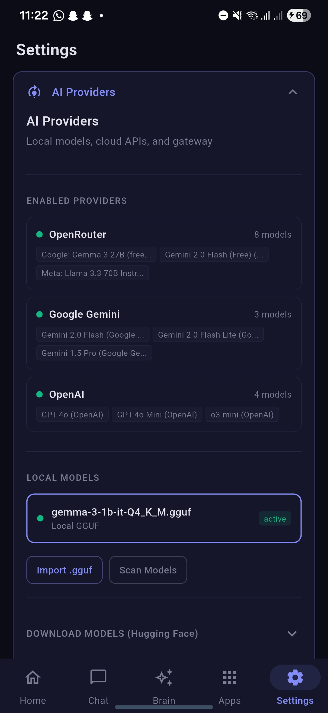

<p align="center">
  
</p>

<h1 align="center">Prism — Your Offline AI Hub</h1>

<p align="center">
  <strong>A centralized, privacy-first AI platform for mobile — download models once, use everywhere.</strong>
</p>

<p align="center">
  <a href="#-key-features">Features</a> •
  <a href="#-the-problem">Problem</a> •
  <a href="#-our-solution">Solution</a> •
  <a href="#-screenshots">Screenshots</a> •
  <a href="#-tech-stack">Tech Stack</a> •
  <a href="#-getting-started">Getting Started</a>
</p>

<p align="center">
  
  
  
  
</p>

---

## 🎯 The Problem

Today's mobile AI landscape is **fragmented and wasteful**:

- **Redundant Downloads**: Every AI app downloads its own models (100MB-4GB each). Users with 5 AI apps may have 5 copies of the *same* model.
- **Storage Bloat**: Phones have limited storage, yet identical 4-bit quantized LLMs are duplicated across apps.
- **No Interoperability**: Apps can't share AI capabilities — each reinvents inference, chat history, and tooling.
- **Privacy Concerns**: Cloud AI requires sending personal data to external servers.
- **Battery Drain**: Multiple apps running separate inference engines = poor battery life.

## 💡 Our Solution

**Prism** is a **centralized offline AI hub** that:

1. **Single Model Repository**: Download models once, available to all compatible apps via a local API.
2. **Inter-App AI Hosting**: Apps can request inference from Prism instead of bundling their own models — powered by a local Shelf HTTP server.
3. **Privacy-First**: All inference runs 100% on-device. Your data never leaves your phone.
4. **Unified Chat & Tools**: One place for conversations, with function calling, second brain, and productivity tools.
5. **Efficient Resource Use**: Single inference engine, shared model weights, optimized battery.

### How It Works

```
┌─────────────────────────────────────────────────────────────────┐
│                         PRISM APP                                │
│  ┌──────────────┐  ┌──────────────┐  ┌──────────────┐           │
│  │   Chat UI    │  │  Second Brain│  │   Tools      │           │
│  └──────────────┘  └──────────────┘  └──────────────┘           │
│            │               │               │                     │
│            └───────────────┼───────────────┘                     │
│                            ▼                                     │
│                  ┌──────────────────┐                            │
│                  │   AI Service     │                            │
│                  │  (LangChain.dart)│                            │
│                  └────────┬─────────┘                            │
│                           │                                      │
│            ┌──────────────┼──────────────┐                       │
│            ▼              ▼              ▼                       │
│     ┌──────────┐   ┌──────────┐   ┌──────────┐                   │
│     │  Local   │   │  Cloud   │   │  Shelf   │  ◄── Other Apps  │
│     │  Models  │   │  APIs    │   │  Server  │      Request AI  │
│     │ (GGUF)   │   │(OpenAI)  │   │ (HTTP)   │                   │
│     └──────────┘   └──────────┘   └──────────┘                   │
└─────────────────────────────────────────────────────────────────┘
```

**Other apps** can simply `POST /v1/chat/completions` to `localhost:8080` to use Prism's models — no SDK needed!

---

## 📸 Screenshots

> Click each section to expand and view screenshots with detailed explanations.

<details>
<summary><strong>🏠 Home Dashboard</strong></summary>

### Welcome Screen


**What it shows:** Personalized greeting with daily digest, quick-access tiles for AI status, weather, and upcoming events.

**Use case:** Landing page that gives you an instant overview of your day and quick access to AI chat.

**Source file:** [`lib/features/home/home_screen.dart`](lib/features/home/home_screen.dart)

---

### Home Scrolled View


**What it shows:** Scrollable dashboard with embedded widgets for tasks, AI model status, schedule preview, and financial summary.

**Use case:** All-in-one glance at your productivity metrics without switching screens. Tasks due today, pending expenses, and AI availability.

**Source file:** [`lib/features/home/home_screen.dart`](lib/features/home/home_screen.dart)

</details>

<details>
<summary><strong>💬 Chat & Tool Calling</strong></summary>

### Chat with Tool Execution


**What it shows:** Real-time chat interface with AI showing available tools. The model responds with structured tool calls (e.g., `add_task`, `log_expense`).

**Use case:** Natural language task creation — say "Add a task to review PR #123 by Friday" and the AI executes it via function calling.

**Key features:**
- Real-time streaming responses
- Tool call visualization (shows which function was invoked)
- Automatic conversation persistence

**Source files:**
- Chat UI: [`lib/features/chat/chat_screen.dart`](lib/features/chat/chat_screen.dart)
- Tool registry: [`lib/core/ai/tool_registry.dart`](lib/core/ai/tool_registry.dart)
- AI service: [`lib/core/ai/ai_service.dart`](lib/core/ai/ai_service.dart)

</details>

<details>
<summary><strong>🧠 Second Brain (Knowledge Base)</strong></summary>

### Notes Section


**What it shows:** Notes grid with search bar and tag filters. Each note displays title, content preview, tags, and last modified date.

**Use case:** Build your personal knowledge base. Notes are searchable via FTS5 full-text search and can be used for RAG (retrieval-augmented generation).

**Key features:**
- Tag-based filtering
- Search across all notes
- Grid/list view toggle
- Responsive layout for tablet

**Source file:** [`lib/features/brain/brain_screen.dart`](lib/features/brain/brain_screen.dart)

---

### Note Editor


**What it shows:** Note detail panel with inline editing for title, content, and tags. Shows created/updated timestamps.

**Use case:** Quick note capture with tagging for later retrieval. Edit mode with save/cancel actions.

**Source file:** [`lib/features/brain/brain_screen.dart`](lib/features/brain/brain_screen.dart) (see `_NoteDetailPanel` widget)

---

### Persona Configuration


**What it shows:** AI persona cards with customizable name, system prompts, and activation toggle. Multiple personas for different use cases.

**Use case:** Create distinct AI personalities — "Work Assistant" with professional tone, "Creative Writer" for brainstorming, or "Study Buddy" for learning.

**Source file:** [`lib/features/settings/personas_section.dart`](lib/features/settings/personas_section.dart)

</details>

<details>
<summary><strong>📱 Apps Hub</strong></summary>

### Apps Overview


**What it shows:** Central hub for all productivity modules: Tasks, Finance, Files, Tools, and Gateway.

**Use case:** Quick navigation to specialized features without cluttering the main interface.

**Source file:** [`lib/features/apps/apps_hub_screen.dart`](lib/features/apps/apps_hub_screen.dart)

---

### Tasks (List View)


**What it shows:** Task manager with priority badges (high/medium/low), due dates, and completion checkboxes. Expandable detail view.

**Use case:** Traditional task list with quick editing. AI can add tasks via `add_task` tool from chat.

**Source file:** [`lib/features/apps/tasks_sub_screen.dart`](lib/features/apps/tasks_sub_screen.dart)

---

### Tasks (Kanban Board)


**What it shows:** Drag-and-drop Kanban board with columns: Todo, In Progress, Done. Visual workflow management.

**Use case:** Agile-style task management for larger projects. Drag tasks between stages.

**Source file:** [`lib/features/apps/tasks_sub_screen.dart`](lib/features/apps/tasks_sub_screen.dart)

---

### Finance Tracker


**What it shows:** Transaction list with income/expense categorization, running balance, and category filters.

**Use case:** Track spending via AI ("Log $42 for groceries") or manual entry. Monthly summaries and trend analysis.

**Source file:** [`lib/features/apps/finance_sub_screen.dart`](lib/features/apps/finance_sub_screen.dart)

</details>

<details>
<summary><strong>🗂️ Files & Tools</strong></summary>

### Files Browser


**What it shows:** Virtual filesystem with folder tree and file grid. Supports text, markdown, and JSON files.

**Use case:** Store documents that AI can read/write via `file_ops` tool. Import/export knowledge base content.

**Source file:** [`lib/features/apps/files_sub_screen.dart`](lib/features/apps/files_sub_screen.dart)

---

### Markdown Viewer


**What it shows:** Rendered markdown with syntax highlighting, headers, lists, and code blocks.

**Use case:** View documentation, meeting notes, or AI-generated reports with proper formatting.

**Source file:** [`lib/features/apps/files_sub_screen.dart`](lib/features/apps/files_sub_screen.dart)

---

### Available Tools


**What it shows:** Tool registry with all available function calling capabilities: `add_task`, `log_expense`, `search_notes`, `get_weather`, etc.

**Use case:** Discover what the AI can do. Each tool shows its parameters and description.

**Source file:** [`lib/features/apps/tools_sub_screen.dart`](lib/features/apps/tools_sub_screen.dart)

---

### MCP Servers


**What it shows:** Model Context Protocol server configuration. Connect to external tool providers.

**Use case:** Extend Prism's capabilities via MCP servers — add custom tools without modifying code.

**Source file:** [`lib/features/apps/tools_sub_screen.dart`](lib/features/apps/tools_sub_screen.dart)

</details>

<details>
<summary><strong>🌐 Gateway (Inter-App AI)</strong></summary>

### Gateway Server Running


**What it shows:** Local HTTP server status with endpoint URL (`localhost:8080`), active model, and request counter.

**Use case:** Enable other apps on your device to use Prism's AI models via OpenAI-compatible API. No SDK needed.

**Key features:**
- POST `/v1/chat/completions` endpoint
- Model switching
- Request logging

**Source file:** [`lib/features/apps/gateway_sub_screen.dart`](lib/features/apps/gateway_sub_screen.dart)

</details>

<details>
<summary><strong>⚙️ Settings</strong></summary>

### Settings Overview


**What it shows:** Settings categories: Providers, Appearance, Voice, Privacy, Data, and About.

**Use case:** Configure AI providers, switch themes, manage data exports, and view app info.

**Source file:** [`lib/features/settings/settings_screen.dart`](lib/features/settings/settings_screen.dart)

---

### Data & Storage


**What it shows:** Storage usage breakdown, export/import buttons, and cache management.

**Use case:** Export your data as JSON, clear old chats, or migrate between devices.

**Key features:**
- Database size display
- Export all data as JSON
- Import from backup
- Clear cache/history

**Source files:**
- Settings UI: [`lib/features/settings/data_section.dart`](lib/features/settings/data_section.dart)
- Database: [`lib/core/database/database.dart`](lib/core/database/database.dart)

</details>

---

## ✨ Key Features

### 🤖 Multi-Provider AI
| Provider | Status | Notes |
|----------|--------|-------|
| **Local GGUF** | ✅ | Gemma, Llama, Phi via llama_sdk FFI |
| **Ollama** | ✅ | Connect to local Ollama server |
| **OpenAI** | ✅ | GPT-4, GPT-4o via API |
| **Google Gemini** | ✅ | Gemini Pro, Flash |
| **OpenRouter** | ✅ | 100+ models via single API |
| **Hugging Face** | ✅ | Download models from HF Hub |

### 💬 Intelligent Chat
- **Real-time Streaming**: Token-by-token response streaming
- **Conversation Management**: Pin, archive, search, delete chats
- **Temporary Chats**: Ephemeral conversations that don't save to history
- **System Prompts**: Customizable AI personality per chat
- **Voice Input**: Speech-to-text via `speech_to_text`

### 🧠 Second Brain (Knowledge Base)
PARA methodology implementation:
- **Areas**: Life domains (Work, Health, Finance)
- **Resources**: Reference materials linked to areas
- **Notes**: Markdown notes with FTS5 full-text search
- **Personas**: Custom AI personalities with instructions
- **Soul Document**: Your values and preferences for AI alignment

### 🛠️ Function Calling Tools
| Tool | Function |
|------|----------|
| `add_task` | Create tasks with priority & due dates |
| `log_expense` | Track finances via natural language |
| `search_notes` | FTS5 search across knowledge base |
| `get_weather` | Weather data retrieval |
| `web_search` | Internet search integration |
| `file_ops` | Read/write virtual filesystem |

### 🔔 Smart Notifications (Android)
- Intercepts notifications from other apps
- AI summarization of notification batches
- Priority scoring and grouping

### 📱 On-Device ML Kit
- **OCR**: Extract text from images
- **Entity Extraction**: Parse dates, money, addresses
- **Smart Reply**: Context-aware response suggestions
- **Language ID**: Detect text language

### 🎨 Beautiful Theming
- 7 accent color presets
- AMOLED dark mode
- Moon Design system components
- Responsive layout (mobile + tablet)

---

## 🛠️ Tech Stack

| Category | Technology |
|----------|------------|
| **Framework** | Flutter 3.10.8 + Dart 3 |
| **UI Library** | Moon Design 1.1.0 |
| **State Management** | Riverpod 2.6 |
| **Routing** | GoRouter 14.8 |
| **Database** | Drift (SQLite) + FTS5 full-text search |
| **AI/LLM** | LangChain.dart + llama_sdk (FFI) |
| **Inter-App Server** | Shelf (localhost HTTP) |
| **ML Kit** | Google ML Kit (OCR, Entity, Smart Reply) |
| **Model Format** | GGUF quantized models |

---

## 🚀 Getting Started

### Prerequisites
- Flutter SDK 3.10.8+
- Android Studio / VS Code
- Android device or emulator (API 24+)

### Installation

```bash
# Clone the repository
git clone https://github.com/Abhijeet1520/prism.git
cd prism

# Install dependencies
flutter pub get

# Generate Drift database code
dart run build_runner build --delete-conflicting-outputs

# Run on device
flutter run
```

### Download Models

1. Open Prism → Settings → Providers
2. Enter your Hugging Face token (for gated models)
3. Browse the model catalog and download:
   - **Gemma 3 1B** (recommended for mobile)
   - **Phi-4 Mini**
   - **TinyLlama 1.1B**

### First Chat

1. Tap "+" to create a new conversation
2. Select your downloaded local model
3. Start chatting — all processing happens on-device!

---

## 🏗️ Architecture

```
lib/
├── main.dart                         # App entry (Riverpod + GoRouter)
├── core/
│   ├── ai/
│   │   ├── ai_service.dart           # LangChain.dart AI backend
│   │   └── tool_registry.dart        # Function calling tools
│   ├── database/
│   │   ├── tables.dart               # Drift table definitions (10 tables)
│   │   ├── database.dart             # PrismDatabase with FTS5
│   │   └── queries.drift             # Custom SQL queries
│   ├── ml/
│   │   └── ml_kit_service.dart       # On-device ML Kit
│   └── theme/
│       └── prism_theme.dart          # Theme system
├── features/
│   ├── chat/                         # AI chat interface
│   ├── brain/                        # Second brain (PARA)
│   ├── home/                         # Dashboard
│   ├── apps/                         # Tools, Files, Finance
│   └── settings/                     # Providers, Theme, About
```

### Database Schema

| Table | Purpose |
|-------|---------|
| `conversations` | Chat sessions with model/provider |
| `messages` | Messages with FTS5 search |
| `task_entries` | Tasks with priority & due dates |
| `transactions` | Income & expenses |
| `areas` | PARA areas of responsibility |
| `resources` | Reference materials |
| `notes` | Knowledge base with FTS5 |
| `resource_areas` | Area ↔ Resource junction |
| `note_resources` | Note ↔ Resource junction |
| `app_settings` | Key-value settings |

---

## 📱 Building for Release

### Debug APK
```bash
flutter build apk --debug
# Output: build/app/outputs/flutter-apk/app-debug.apk
```

### Release APK
```bash
flutter build apk --release
# Output: build/app/outputs/flutter-apk/app-release.apk
```

### App Bundle (Play Store)
```bash
flutter build appbundle --release
# Output: build/app/outputs/bundle/release/app-release.aab
```

### GitHub Release
```bash
# Tag version
git tag -a v0.2.0 -m "Release v0.2.0"
git push origin v0.2.0

# Create release via GitHub CLI
gh release create v0.2.0 build/app/outputs/flutter-apk/app-release.apk \
  --title "Prism v0.2.0" \
  --notes "See CHANGELOG.md for details"
```

Or manually:
1. Go to your repo → Releases → "Create new release"
2. Choose tag `v0.2.0`
3. Upload `app-release.apk` as binary
4. Publish release

---

## 🔒 Privacy & Security

- **100% Offline**: Local models run entirely on-device
- **No Telemetry**: Zero data collection or analytics
- **Local Storage**: All data in SQLite, never synced
- **Open Source**: Fully auditable codebase

---

## 🗺️ Roadmap

- [x] Multi-provider AI (Local, Ollama, Cloud)
- [x] Chat with streaming & history
- [x] Second Brain with PARA methodology
- [x] Function calling tools
- [x] Theme customization
- [x] Model download from Hugging Face
- [ ] Inter-app AI API (Shelf server)
- [ ] iOS support
- [ ] Desktop (Windows, macOS)
- [ ] Model fine-tuning interface
- [ ] Plugin system for custom tools

---

## 👨‍💻 Developer

**Abhijeet**
- Portfolio: [abhi1520.com](https://abhi1520.com)
- GitHub: [@Abhijeet1520](https://github.com/Abhijeet1520)

---

## 📄 License

This project is licensed under the MIT License — see the [LICENSE](LICENSE) file for details.

---

## 🙏 Acknowledgments

- [LangChain.dart](https://github.com/davidmigloz/langchain_dart) — AI chain patterns
- [Drift](https://drift.simonbinder.eu/) — Reactive SQLite for Flutter
- [Moon Design](https://moon.io/) — Beautiful UI components
- [llama.cpp](https://github.com/ggerganov/llama.cpp) — GGUF inference engine
- [Google ML Kit](https://developers.google.com/ml-kit) — On-device ML

---
